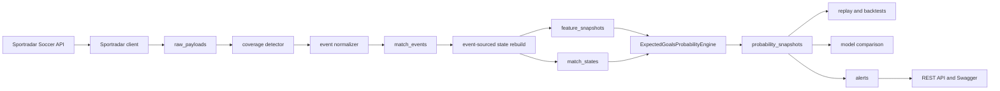

# Soccer Intelligence Engine

Java In-Play Soccer Intelligence Engine is a Spring Boot backend for real-time
soccer analytics. It ingests Sportradar match data, stores raw provider
payloads, normalizes match events, rebuilds match state from an event stream,
extracts model features, calculates explainable win/draw/loss probabilities,
runs replay and backtest workflows, and generates analytical alerts.

This is not a gambling application. The project is framed as a sports-data and
predictive-modeling backend that demonstrates Java, clean architecture, BDD,
provider integration, event sourcing, model evaluation, and operational REST
API design.

## What It Shows

- Java 21 and Spring Boot 4
- Clean domain modeling and service boundaries
- Sportradar Soccer API integration
- Raw payload caching with sanitized request paths
- Coverage-aware ingestion: `RICH`, `STANDARD`, `BASIC`
- Event-sourced match state rebuilds
- Feature extraction for xG, pressure, red cards, momentum, lineups, and team strength
- Pure Java expected-goals/Poisson probability engine
- Model explanations, confidence, and feature contributions
- Replay, selected-match or season backtests, and baseline comparison
- Live tracking, timeline-delta polling, and alert generation
- JUnit, WireMock, and Cucumber BDD tests
- Docker Compose, PostgreSQL, Flyway, Swagger/OpenAPI, GitLab CI

## Architecture



The important design decision is that live tracking, replay, and backtesting all
reuse the same stored-event pipeline:

```text
provider payloads
 -> raw_payloads
 -> normalized match_events
 -> event-sourced match_states
 -> feature_snapshots
 -> probability_snapshots
 -> replay / backtest / comparison / alerts
```

## Stack

- Java 21
- Spring Boot 4.0.6
- Maven Wrapper
- PostgreSQL 16
- Flyway
- Spring Data JPA
- SpringDoc OpenAPI
- JUnit 5
- Cucumber
- WireMock
- Docker Compose

## Local Setup

From the app folder:

```powershell
cd C:\D_DRIVE\Nikita\JS\sports-analytics-engine\soccer-intelligence-engine
docker compose up -d postgres
.\mvnw.cmd test
.\mvnw.cmd spring-boot:run
```

Useful URLs:

- Health: <http://localhost:8080/actuator/health>
- System status: <http://localhost:8080/api/system/status>
- Swagger UI: <http://localhost:8080/swagger-ui/index.html>
- OpenAPI JSON: <http://localhost:8080/v3/api-docs>

## Sportradar API Key

The app starts and all automated tests run without a real Sportradar key. A key
is only required when an endpoint actually calls Sportradar.

```powershell
$env:SPORTRADAR_API_KEY = "your-key"
$env:SPORTRADAR_REQUEST_DELAY_MS = "1100"
```

The delay is important on the trial tier because the Soccer API commonly allows
1 request per second.

## Configuration

Common environment variables:

```text
SPRING_DATASOURCE_URL=jdbc:postgresql://localhost:5432/soccer_intelligence
SPRING_DATASOURCE_USERNAME=soccer
SPRING_DATASOURCE_PASSWORD=soccer
SPORTRADAR_API_KEY=
SPORTRADAR_LOCALE=en
SPORTRADAR_ACCESS_LEVEL=trial
SPORTRADAR_PACKAGE_NAME=soccer-extended
SPORTRADAR_BASE_URL=https://api.sportradar.com
SPORTRADAR_REQUEST_DELAY_MS=1100
SPORTRADAR_MAX_RETRIES=2
SPORTS_LIVE_ENABLED=false
SPORTS_LIVE_POLL_DELAY_MS=10000
SPORTS_LIVE_FULL_TIMELINE_REFRESH_MS=60000
SPORTS_LIVE_MAX_MATCHES_PER_TICK=3
```

Live polling is disabled by default to protect API quota.

## Main Workflow

Track one Sportradar match:

```powershell
$track = Invoke-RestMethod `
  -Method Post `
  -Uri http://localhost:8080/api/matches/track `
  -ContentType "application/json" `
  -Body '{"sportEventId":"sr:sport_event:70075140","forceRefresh":true}'

$matchId = $track.matchId
```

Inspect analytics:

```powershell
Invoke-RestMethod "http://localhost:8080/api/matches/$matchId/state"
Invoke-RestMethod "http://localhost:8080/api/matches/$matchId/probabilities/latest"
Invoke-RestMethod "http://localhost:8080/api/matches/$matchId/probabilities/timeline"
Invoke-RestMethod "http://localhost:8080/api/matches/$matchId/alerts"
```

Replay the stored match:

```powershell
Invoke-RestMethod `
  -Method Post `
  -Uri "http://localhost:8080/api/matches/$matchId/replay" `
  -ContentType "application/json" `
  -Body '{"forceRefresh":false}'
```

Run a selected-match backtest:

```powershell
Invoke-RestMethod `
  -Method Post `
  -Uri http://localhost:8080/api/seasons/sr:season:demo/backtests `
  -ContentType "application/json" `
  -Body '{"sportEventIds":["sr:sport_event:70075140"],"forceRefresh":false,"continueOnMatchFailure":true}'
```

Start and stop live tracking for an already stored match:

```powershell
$env:SPORTS_LIVE_ENABLED = "true"

Invoke-RestMethod -Method Post -Uri "http://localhost:8080/api/matches/$matchId/track"
Invoke-RestMethod "http://localhost:8080/api/matches/live"
Invoke-RestMethod -Method Delete -Uri "http://localhost:8080/api/matches/$matchId/track"
```

## Probability Model

The `ExpectedGoalsProbabilityEngine` is a pure Java service. It uses the current
score as the fixed starting point, estimates remaining expected goals, and then
runs a Poisson-style final-score simulation.

Inputs include:

- current score and minute
- home advantage
- standings and form strength
- lineup and formation context
- red cards
- rolling xG delta
- shot pressure and shot location quality
- field tilt and possession pressure
- Sportradar momentum trend
- coverage availability

Outputs include:

- home win probability
- draw probability
- away win probability
- model confidence
- coverage quality
- explanations
- signed feature contributions

Provider probability is used only as comparison context. It is not blended into
the model output.

## Backtesting And Evaluation

Backtests are synchronous and persist a completed `backtest_runs` row. The
metrics JSON is versioned as `stage5.5-v1`.

Metrics include:

- fixed-minute headline Brier score and log loss
- fixed-minute buckets: `0`, `15`, `30`, `HT`, `60`, `75`, `85`
- all in-play metrics
- final-snapshot diagnostic metrics
- random, score-only, and provider baselines
- minute-bucket calibration
- event movement by event type
- per-match metrics and failures

Final snapshots are intentionally not used as the headline score because they
mostly measure whether the model can read the final score.

## Alerts

Alerts are generated after tracking, rebuilds, probability rebuilds, and live
poll updates.

Current alert types:

- `MODEL_PROVIDER_DIVERGENCE`
- `RED_CARD_PROBABILITY_SWING`
- `PRESSURE_DESPITE_LOSING`
- `XG_CONTRADICTS_SCORELINE`
- `LATE_MOMENTUM_SHIFT`

Alerts use deterministic deduplication keys, so repeated rebuilds and repeated
live deltas do not create duplicate rows.

## Testing

Run all tests:

```powershell
.\mvnw.cmd test
```

Test layers:

- JUnit tests for domain invariants, probability math, feature extraction,
  event mapping, state projection, backtest metrics, live polling, and alerts
- WireMock tests for the real Sportradar HTTP client, `.json` URL shape, `429`
  retry behavior, `404` handling, `5xx` exhaustion, and transport failures
- Cucumber BDD scenarios backed by saved Sportradar fixtures
- H2-backed Spring tests for API and application workflows

Saved fixtures live under:

```text
src/test/resources/fixtures/sportradar/demo
```

No automated test requires `SPORTRADAR_API_KEY`.

## Docker

Start PostgreSQL only:

```powershell
docker compose up -d postgres
```

Run the packaged app through Compose:

```powershell
.\mvnw.cmd -DskipTests package
docker compose --profile app up --build
```

## CI

The GitLab pipeline uses Java 21, runs:

```text
./mvnw -B test
./mvnw -B -DskipTests package
```

and publishes the packaged jar as an artifact. CI does not require a real
Sportradar key.

## More Docs

- [Demo script](docs/demo-script.md)
- [API examples](docs/api-examples.md)

## Current Limits

- The probability model is intentionally simplified for a portfolio project.
- It is useful for demonstrating backend design and model evaluation, not for
  commercial odds-making.
- Sportradar trial coverage varies by match. The app handles missing rich data
  through `STANDARD` and `BASIC` fallback modes.
- Kafka/RabbitMQ and a frontend dashboard are not included.
